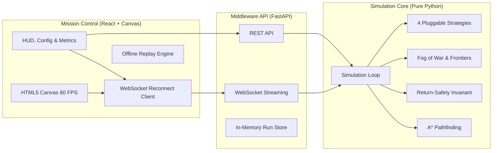

# Lost in Space — Rover Mission Control 🚀🪐

Production-grade, full-stack simulation and mission control dashboard for an autonomous planetary rover navigating an unknown environment with partial observability, dynamic terrain hazards, and energy constraints.

---

## 🌟 Highlights & Architecture

- **Pure Python Simulation Core (`backend/engine`):** Zero web dependencies, 100% reproducible and seeded, headless CLI runner, and fully unit-tested with Pytest.
- **High-Throughput Telemetry API (`backend/app`):** FastAPI REST & WebSocket streaming with Pydantic contract validation and incremental snapshot diffing.
- **Mission Control Web Dashboard (`frontend`):** React 18, TypeScript, and HTML5 Canvas delivering 60 FPS on 50x50 grids, fog of war, particle upload effects, live charts, timeline scrubbing, and offline replay.
- **Offline Replay Mode:** Zero backend dependency requirement — drag and drop `snapshots.json` to review recorded missions anywhere.



---

## 🎯 Design Decisions & Challenge Mapping

| Problem Challenge | Architectural Mechanism | Implementation File |
| :--- | :--- | :--- |
| **1. Unknown Environment & Partial Observability** | Separate `known_map` from ground-truth `true_map`. Bresenham Line-of-Sight sensor raycasting and dynamic frontier extraction bordering unexplored cells. | [`backend/engine/sensing.py`](file:///C:/Users/3ai1/.gemini/antigravity/scratch/rover-mission-control/backend/engine/sensing.py) |
| **2. Limited Energy Management** | Strict energy accounting per move ($1\text{J}$ open, $4\text{J}$ hazard), collection ($2\text{J}$), and transmission ($2\text{J}$). Edge-weighted A* pathfinding. | [`backend/engine/pathfinding.py`](file:///C:/Users/3ai1/.gemini/antigravity/scratch/rover-mission-control/backend/engine/pathfinding.py) |
| **3. High-Value Targets in Hazardous Terrain** | Hard Mode generator shielding maximum value sites behind rings of hazard terrain; Value-Aware ROI planner balancing payoff vs. traversal cost. | [`backend/engine/environment.py`](file:///C:/Users/3ai1/.gemini/antigravity/scratch/rover-mission-control/backend/engine/environment.py)<br>[`backend/engine/strategies/value_aware.py`](file:///C:/Users/3ai1/.gemini/antigravity/scratch/rover-mission-control/backend/engine/strategies/value_aware.py) |
| **4. Balanced Exploration vs. Safe Return** | **Return-Safety Invariant**: Evaluated at every step ($E \le C_{\text{return}} + M_{\text{safety}}$). Overrides speculative exploration and locks navigation onto communication zones. | [`backend/engine/safety.py`](file:///C:/Users/3ai1/.gemini/antigravity/scratch/rover-mission-control/backend/engine/safety.py) |
| **5. Strategic Decision Impact** | Risk-Aware adaptive safety buffer that dynamically increases margin based on distance from base and surrounding hazard density. | [`backend/engine/strategies/risk_aware.py`](file:///C:/Users/3ai1/.gemini/antigravity/scratch/rover-mission-control/backend/engine/strategies/risk_aware.py) |
| **6. Dynamic Terrain Blocking Mid-Mission** | Mid-mission dynamic cave-ins that turn open cells into obstacles. Active planned path intersection triggers immediate A* replanning with visual alerts. | [`backend/engine/simulation.py`](file:///C:/Users/3ai1/.gemini/antigravity/scratch/rover-mission-control/backend/engine/simulation.py) |

---

## 🚀 Quickstart & Run Instructions

### 1. Headless CLI Engine (Pure Python)
```bash
# Run single simulation
python backend/cli.py --seed 42 --strategy value_aware --size 25 --energy 220

# Run multi-seed comparison benchmark across all 4 strategies
python backend/cli.py --compare --runs 5

# Export run to JSON
python backend/cli.py --seed 42 --strategy greedy --export sample_data/my_run.json
```

### 2. Run Backend API
```bash
# Install dependencies
pip install -r backend/requirements.txt

# Run test suite
python -m pytest backend/tests -v

# Start FastAPI server (runs on http://localhost:8000)
python -m uvicorn backend.app.main:app --reload --host 0.0.0.0 --port 8000
```

### 3. Run Mission Control Frontend
```bash
cd frontend
npm install
npm run dev
# Dashboard launches on http://localhost:5173
```

### 4. Docker Compose (Full Stack)
```bash
docker compose up --build
```

---

## ⚡ 3-Minute Hackathon Demo Script

Follow this script to demonstrate the core capabilities within 3 minutes:

### Step 1: Demonstrate Mission Success (60s)
1. Open the dashboard at `http://localhost:5173`.
2. Keep default settings (`Seed: 42`, `Strategy: greedy`, `Energy: 220`).
3. Press **Space** or click **Play ▶**.
4. Observe the rover exploring frontiers, harvesting amber data crystals (+25, +40 pts), and uploading data at the green comm zone base.
5. Notice the **Return Safety Threshold marker** on the energy HUD. When battery decreases near the return cost, the rover transitions automatically to `RETURNING` mode and finishes with `SUCCESS`!

### Step 2: Demonstrate Dynamic Replanning in Action (45s)
1. Set `Dynamic Block Rate` slider to `12%` and click **⚡ LAUNCH MISSION**.
2. Press **Play ▶** or use **ArrowRight** to step through.
3. Watch for the red **REPLANNING ROUTE** banner appearing when a dynamic cave-in blocks the rover's planned trajectory.
4. Check the **Mission Event Log** at the bottom-right showing `🚨 Dynamic Cave-in: Obstacle blocked path at [X, Y]` followed by `⚡ Route Replanned`.

### Step 3: Demonstrate Mission Failure Case (`LOST`) (30s)
1. Set `Max Energy` to `45` J (insufficient for full return).
2. Click **⚡ LAUNCH MISSION** and press **Play ▶**.
3. Watch the rover venture outward, attempt to return, and run completely out of battery in the void outside a comm zone.
4. The mode badge transitions to red `LOST`, triggering the failure telemetry state.

### Step 4: Strategy Benchmark Comparison & Offline Replay (45s)
1. Click the **STRATEGY BENCHMARK** tab at the top.
2. Click **⚡ RUN 5-SEED BENCHMARK**.
3. Point to the comparative bar charts and statistical table comparing Greedy, Frontier, Risk-Aware, and Value-Aware strategies.
4. Click the **OFFLINE REPLAY** tab.
5. Drag and drop `sample_data/snapshots_demo.json` to prove full offline demonstration capability even without a running backend.

---

## 📁 Repository Structure

```
rover-mission-control/
├── README.md
├── docker-compose.yml
├── Makefile
├── .gitignore
├── backend/
│   ├── requirements.txt
│   ├── pyproject.toml
│   ├── app/
│   │   ├── main.py                # FastAPI app, CORS, routers, lifespan
│   │   ├── config.py              # Settings and defaults
│   │   ├── api/                   # REST & WebSocket routes
│   │   ├── schemas/               # Shared Pydantic schemas
│   │   ├── services/              # Run manager, store, and exporter
│   │   └── middleware/            # Logging and structured error handlers
│   ├── engine/
│   │   ├── environment.py         # Grid terrain, cellular automata, dynamic blocking
│   │   ├── rover.py               # Rover state and energy model
│   │   ├── sensing.py             # Fog of war, line of sight, frontiers
│   │   ├── pathfinding.py         # Energy-weighted A* pathfinding
│   │   ├── safety.py              # Return-safety rule evaluation
│   │   ├── simulation.py          # Step loop, state machine, snapshots
│   │   ├── metrics.py             # Telemetry calculation and stats
│   │   ├── batch.py               # Multi-seed strategy benchmarking
│   │   └── strategies/            # Greedy, Frontier, Risk-Aware, Value-Aware
│   ├── cli.py                     # Headless CLI runner
│   └── tests/                     # 20 Unit & integration tests
├── frontend/
│   ├── package.json
│   ├── tsconfig.json
│   ├── vite.config.ts
│   ├── index.html
│   └── src/
│       ├── main.tsx
│       ├── App.tsx
│       ├── types/                 # TypeScript types mirroring Pydantic schema
│       ├── api/                   # REST and WebSocket clients
│       ├── store/                 # Zustand mission store
│       ├── canvas/                # Layered HTML5 Canvas 60 FPS renderer
│       ├── components/            # HUD, Controls, Config, Metrics, Charts, Timeline, Log
│       ├── hooks/                 # Keyboard shortcuts and playback intervals
│       └── styles/theme.css       # Space dark neon theme
├── sample_data/
│   ├── snapshots_demo.json        # Pre-generated 125-step run for offline replay
│   ├── comparison_demo.json       # Pre-generated multi-seed benchmark results
│   └── generate_demo_data.py      # Demo data generator script
└── docs/
    ├── architecture.md            # Three-tier design and Mermaid diagrams
    ├── algorithms.md              # Mathematical formulas for A*, safety, and strategies
    └── evaluation.md              # Telemetry metric definitions and analysis
```

---

## 🧪 Test Coverage Summary

Run full backend test suite:
```bash
python -m pytest backend/tests -v
```

Tests cover:
- Reachability guarantees from start to all data sites and comm zones (`test_environment.py`)
- Cellular automata terrain generation and hard mode hazard placement (`test_environment.py`)
- Energy-weighted A* optimality and hazard avoidance (`test_pathfinding.py`)
- Return-safety invariant and strand prevention (`test_safety.py`)
- Simulation determinism and collision avoidance (`test_simulation.py`)
- REST endpoints, export formats (JSON/CSV), and WebSocket streams (`test_api.py`)
