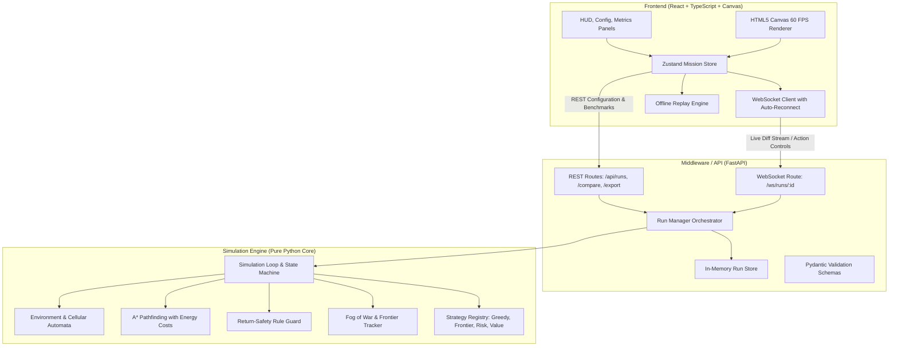

# System Architecture: Lost in Space - Rover Mission Control

## 1. High-Level Architecture Overview

The system is engineered as a three-tier decoupled architecture:
1. **Simulation Engine (Pure Python):** Fully headless, deterministic, zero web dependencies, unit-testable.
2. **Middleware & API Layer (FastAPI):** High-throughput REST endpoints and WebSocket diff streaming with Pydantic contract validation and swappable in-memory storage.
3. **Mission Control Frontend (React + TypeScript + Vite):** HTML5 Canvas rendering engine delivering 60 FPS on 50x50 grids, live telemetry charts, timeline scrubbing, and offline replay capabilities.

---

## 2. Layer Responsibilities & Contracts

### A. Pure Python Simulation Core (`backend/engine`)
- **Isolation:** Has zero dependencies on web frameworks, FastAPI, or networking. Can be imported directly into Python scripts or run headlessly via `backend/cli.py`.
- **Determinism:** Governed by an isolated `random.Random(seed)` instance passed through all subsystem components.
- **Reachability Guarantees:** Cellular automata terrain generation followed by Breadth-First Search (BFS) reachability validation to ensure all data sites and base comm zones are strictly reachable from the mission start point.

### B. Middleware & Telemetry API (`backend/app`)
- **Single Source of Truth:** Pydantic schemas (`RunConfig`, `SnapshotSchema`, `RoverStateSchema`, `MetricsSchema`) define the shared contract mirrored in TypeScript.
- **Incremental Payload Optimization:** Sends full ground-truth map on step 0, streaming only cell mutations (`map_diffs`) and active frontiers in subsequent ticks to minimize WebSocket overhead.
- **Swappable Persistence:** Backed by `BaseRunStore` interface allowing in-memory store to be replaced with Redis or PostgreSQL without modifying API controllers.

### C. Mission Control Dashboard (`frontend/src`)
- **Canvas Rendering Engine:** Layered canvas drawing using `requestAnimationFrame`, featuring:
  - Vector rover chassis with directional heading interpolation and status glow.
  - Soft light falloff around sensor vision radius over dark fog of war.
  - Particle systems for data upload beacons.
  - Flashing warnings and banners upon dynamic terrain blockages.
- **Offline Replay Mode:** Zero backend dependency requirement. Allows loading `snapshots.json` directly through HTML5 drag-and-drop or file pickers.
